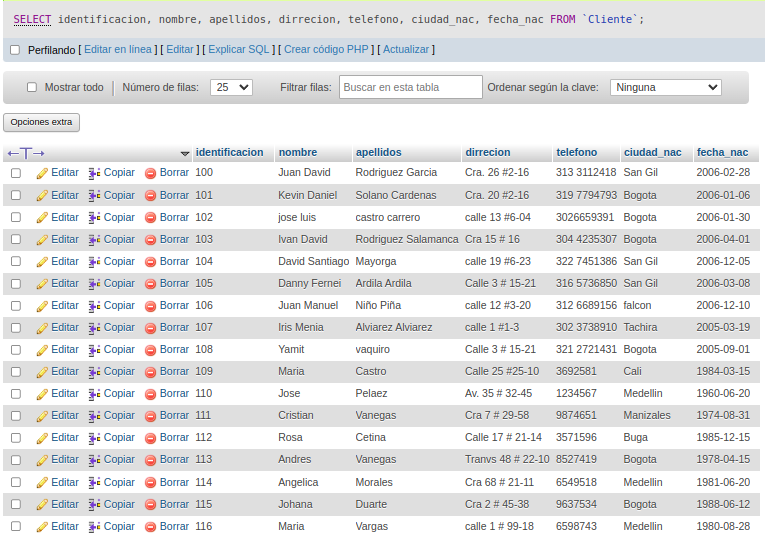

# Consultas_1_SQL
# INtroduccion a las consultas a una BD usando el lenguaje SQL 

## Base de datos: Ventas 
## Tabla: Cliente 

## Instruccion SELECT
- permite seleccionar datos de una tabla.
-su formato es: 'SELECT campos_tablas FROM nombre_tabla''

### Consulta No. 1
1. Para visualizar toda la informacion que contiene la tabla Cliente se puede incluir con la instruccion SELECT el caracter **\*** o cada uno de los campos de la tabla.

- 'SELECT * FROM cliente'

- 'SELECT identificacion, nombre, apellidos, direccion, telefono, ciudad_nac, fecha_nac FROM Cliente'

### Consulta No. 2

2. Para visualizar solamente la identificacion del Cliente: 'SELECT identificacion FROM Cliente'

### Consulta No.3

3. si se desea obtener los registros cuya identificacion sea mayor o igual a 150, se debe utilizar la clausula 'WHERE' que especifica las condiciones que deben reunir los registros que se van a seleccionar: 'SELECT * FROM Cliente WHERE identificacion>=150
